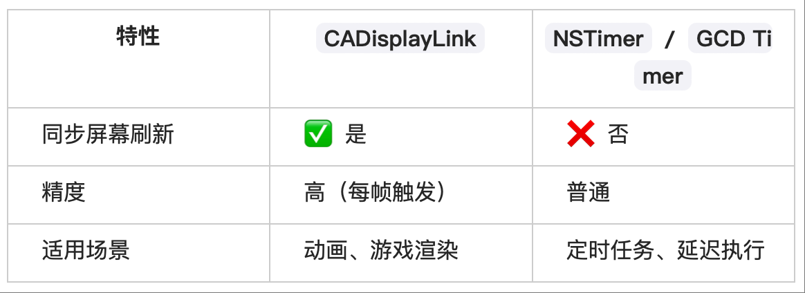

#  CADisplayLink

CADisplayLink 是iOS 提供的一种定时器类，属于 Core Animation 框架。

它的特点是会和 屏幕刷新率同步回调，因此非常适合需要和屏幕绘制保持一致的场景。

## 一、CADisplayLink 是什么？
CADisplayLink 本质上是一个 定时器 (Timer)。

它的调用频率和屏幕的刷新频率保持一致（例如大多数 iPhone 上是 60Hz，高刷屏可能是 120Hz）。

每次屏幕刷新前，系统会回调一次绑定的 selector 方法，让你有机会更新动画数据，再交由 GPU/CPU 渲染。

## 二、能做什么？
1. 驱动动画
在每一帧刷新时更新动画中的属性（如位置、透明度、缩放等），实现平滑的动画效果。
比 NSTimer 或 sleep 更适合做动画，因为它和屏幕刷新同步，不会出现掉帧或卡顿。

2. 自定义绘制
配合 Core Graphics 或 Metal/OpenGL，在每一帧中做手动绘制。
例如游戏渲染、波浪动画、进度环动画等。

3. 监控帧率
用 CADisplayLink 统计 1 秒钟内的回调次数，就能得出当前 FPS（Frame Per Second）。
常用于性能调试。

## 三、使用方式

    // 3. 创建 CADisplayLink
    self.displayLink = [CADisplayLink displayLinkWithTarget:self selector:@selector(updateFrame:)];
    [self.displayLink addToRunLoop:[NSRunLoop mainRunLoop] forMode:NSRunLoopCommonModes];

* preferredFramesPerSecond 可以设置回调频率（默认与屏幕刷新率一致）。
* iOS 10 之前用 frameInterval（整数，表示隔几帧回调一次）。
* 使用完后需要 invalidate，否则会导致循环引用或 CPU 资源浪费。

## 四、和 NSTimer / GCD 定时器区别

👉 总结：
CADisplayLink 是 iOS 提供的 屏幕刷新驱动定时器，核心用途是 平滑动画驱动 & 自定义绘制，并且常用于性能调试（FPS 监控）。

