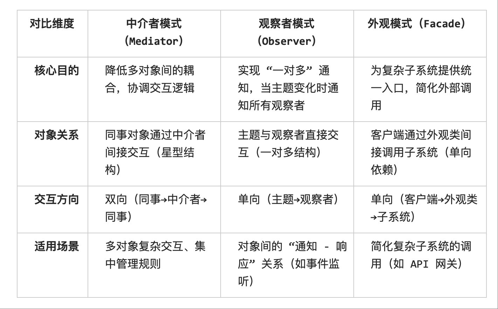

#  中介者模式（Mediator Pattern）

中介者模式（Mediator Pattern）是一种行为型设计模式，

**核心思想是用一个中介对象来封装一组对象之间的交互，让对象之间不直接引用彼此，从而降低它们之间的耦合度**。

可以把它想象成——
如果没有中介者，每个人都得互相打电话联系；有了中介者，大家只需要和中介打交道，减少关系网的复杂程度。

## 1. 定义

中介者模式：通过一个中介对象来封装一系列对象之间的交互，使得各对象不再显式地相互引用，从而使其耦合松散，且可以独立地改变它们之间的交互。

2. 组成结构

角色职责
1. Mediator（抽象中介者）
定义同事对象通信的接口。 

2. ConcreteMediator（具体中介者）
实现协调逻辑，维护各个同事对象的引用。 

3. Colleague（抽象同事类）
依赖中介者与其他同事通信，而不是直接调用同事对象。 

4. ConcreteColleague（具体同事类）
通过中介者与其他同事交互。 

## 3. 优点

✅ 降低对象耦合度：对象之间不直接交互，减少了依赖关系。
✅ 集中控制交互逻辑：集中控制交互，交互逻辑集中在中介者中，方便管理和修改。
✅ 便于扩展：增加新的同事类，不需要修改其他同事类，只需修改中介者。

## 4. 缺点
⚠ 中介者可能变得复杂：随着交互逻辑增多，中介者会变成一个庞大、难维护的“上帝类”。
⚠ 可能隐藏交互细节：交互细节都集中在中介者，调试和排查可能不直观。

## 5. 适合解决的问题

中介者模式适合用在：

1. 对象之间存在复杂的网状交互（多对多关系），希望简化成星型结构。
2. 交互逻辑频繁变化，不希望改动多个类。
3. 需要集中管理交互行为，避免散落在各个类中。

不适合的场景
需明确中介者模式的 “禁区”，避免滥用：

1. 仅少数对象间存在简单交互（如 2 个对象间的单向依赖），无需引入中介者（否则会增加不必要的复杂度）。
2. 对象间的交互规则频繁变化且个性化（如每个对象有独特的交互逻辑），此时中介者会快速膨胀，不如让对象自行处理交互。

## 6. 生活例子
1. 聊天室系统：多个用户（同事）通过聊天室服务器（中介者）发送和接收消息，而不是直接互发。
2. 航班调度系统：飞机（同事）不直接与其他飞机通信，而是通过塔台（中介者）协调。
3. UI 控件交互：窗口中的按钮、输入框、下拉框等控件通过一个中介者（如 Dialog 类）来协调行为。

与其他模式的区别
为避免混淆，需明确中介者模式与相似模式的差异：

 
## 总结

中介者模式的核心是 “用一个中介者替代多对象间的直接交互”，其价值在于解耦和集中控制，但需警惕中介者 “膨胀” 和 “单点依赖” 的问题。在实际开发中，需结合场景判断：若对象间交互复杂且规则稳定，中介者模式能显著提升系统可维护性；若交互规则多变或对象数量少，则应避免使用，以免增加不必要的复杂度。

代码解析

上述实现中，我们构建了一个简单的聊天室系统，包含以下几个核心部分：

1. 抽象中介者（Mediator 协议）：定义了注册同事和转发消息的接口
2. 具体中介者（ChatRoomMediator）：实现了聊天室的功能，维护所有用户列表，并负责消息转发
3. 抽象同事（Colleague）：定义了用户的基本行为（发送和接收消息），并持有中介者的引用
4. 具体同事（User）：实现了具体的用户行为，重写了消息接收方法
